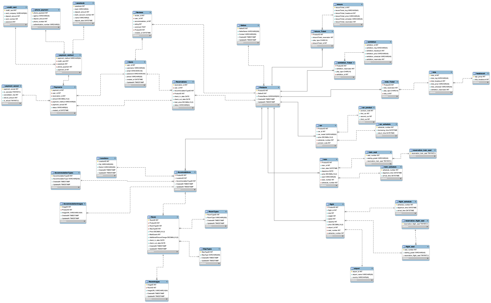

# 🏨 DB_yanolja - 데이터베이스 설계 프로젝트

**야놀자(숙박 예약 플랫폼)**를 기반으로 기획된 데이터베이스 설계 프로젝트입니다.  
숙박, 레저, 교통, 결제 등 실제 상업 서비스에서 필요한 모든 도메인 요소를 반영한  
**정규화된 관계형 데이터베이스(RDBMS)** 구조를 설계하고 SQL로 구현했습니다.

---

## 🧩 ERD 설계도

본 프로젝트의 전체 데이터베이스 스키마 관계(ERD)는 다음과 같습니다:

---

## 📦 프로젝트 목표

- 실제 서비스 구조를 반영한 정규화된 스키마 설계
- 사용자 → 예약 → 결제 흐름의 데이터 플로우 구현
- 다양한 상품(Product) 유형 관리 (숙박, 레저, 교통 등)
- 결제 수단, 환불 처리까지 포함한 종합적인 설계

---

## 📁 주요 파일

| 파일명 | 설명 |
|--------|------|
| `yanoljs.sql` | 전체 테이블 생성 SQL 스크립트 |
| `DB구축을 위한 스키마 설계 프로젝트.pdf` | 설계 문서 (ERD 포함) |
| `yanolja_erd.png` | ERD 이미지 (위 삽입됨) |

---

## 🛠 주요 테이블 구성

### 👤 Users
- 회원 정보 관리

### 🏨 숙박 도메인
- `Products`, `Accomodations`, `Rooms`, `RoomImages`, `Reservations`, `Reviews` 등

### 🎡 레저/배움 도메인
- `Play`, `Lesson`, `leisureTicket` 및 카테고리 테이블

### 🚉 교통 도메인
- 항공, 기차, 렌트카 테이블  
- 스케줄, 좌석, 예약 구조 포함

### 💳 결제 도메인
- `Payments`, `payment_method`, `payment_cancel`, 카드/통장/휴대폰 결제 정보 등

---

## 🧰 사용 기술

- DBMS: MySQL / MariaDB 기준
- SQL 표준 문법
- ERD 도구: MySQL Workbench or Draw.io
- 실습 도구: VS Code + DB Client (DBeaver, TablePlus 등)

---

## 🙋‍♀️ 작성자

**dev-parkjs**  
📫 [GitHub 프로필](https://github.com/dev-parkjs)

---

## 📌 참고

본 프로젝트는 개인 포트폴리오 및 데이터베이스 모델링 실습을 목적으로 제작되었습니다.